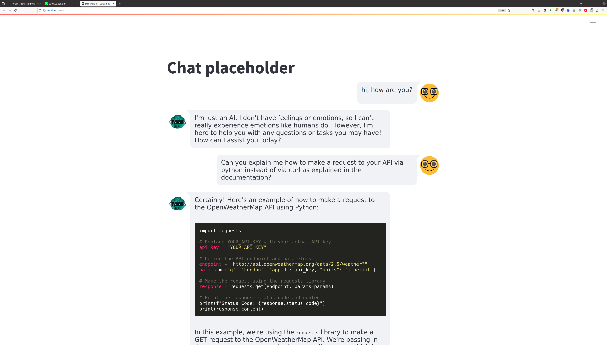
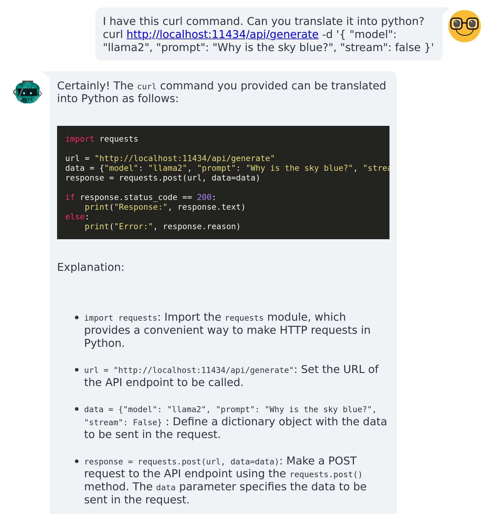

# Chat with Ollama using Streamlit



This is a demo example of a chat using [streamlit chat](https://github.com/AI-Yash/st-chat) component and [ollama](https://ollama.ai/) in the background. 

The [`streamlit_basic.py`]() is kept simple for a minimum reproducible example and is very similar to the [online demo from streamlit](https://ai-yash-st-chat-exampleschatbot-fkuecs.streamlit.app/) More advanced applications will follow.

## Installation

Install [ollama](https://ollama.ai/) ([guide for linux](https://github.com/jmorganca/ollama/blob/main/docs/linux.md)) following the website or any guide.

Install [streamlit](https://docs.streamlit.io/library/get-started) using their documentation, or if you use pip, just run 
```bash
pip install streamlit
pip install streamlit-chat
```

We need the streamlit-chat component for the interaction.

## Get it to run 


### Ollama
Open one terminal and run 
```
ollama run llama2
```
or any other model that you like. It will ask you `>>> Send a message (/? for help)` but you can safely ignore it and let it hanging. It is powering the API behind the scenes!

Open another terminal and run 
```
streamlit run streamlit_basic.py
```
### Streamlit
You may get some warning and then you should see:
```
  You can now view your Streamlit app in your browser.

  Local URL: http://localhost:8501
  Network URL: http://192.168.1.112:8501
```
You can now use it from the local URL (and other people can from the network URL!)


## What we are doing?

We talk with ollama is using the API. In the [documentation](https://github.com/jmorganca/ollama/blob/main/docs/api.md) they show [how to do this using curl](https://github.com/jmorganca/ollama/blob/main/docs/api.md#request-no-streaming) (this is with streaming disabled). 
So we can either run the `curl` command via python, or translate the code and make the same request using python. I preferred the second way, so I asked ollama itself to give the python code to make the request!



We can then make our request using python. In the code (which is, by the way, not perfect but close, it even got the correct URL for the API) we can then use this part. Just as hint, to get very good answer for code-related questions, I suggest using [phind](https://www.phind.com/). Although not open-sourced, it is free and targets code/machine learning questions and gives you references for that, so it is a bit better for these specific queries.
I added only the header:

```python
# Set the URL and headers for the request
url = "http://localhost:11434/api/generate"
headers = {
    "Content-Type": "application/json",
}
# Write the data into the json
data = json.dumps({
    "model": "llama2",
    "prompt": user_input,
    "stream": False,
})
# Make the request
response_API = requests.post(url, headers=headers, data=data)
```

This is the magic behind it. If you are not familiar with request, it contains the `status` (200 means OK or [something else](https://developer.mozilla.org/en-US/docs/Web/HTTP/Status)) and the `.text` field is actually a json string which can be loaded into a python dictionary. The `response` field (as shown [in ollama's docs](https://github.com/jmorganca/ollama/blob/main/docs/api.md#response-1)) is what we are looking for! If you are interested in other data (duration or token counts) you should be able to get them also.

```python
if response_API.status_code == 200:
    response_dict = json.loads(response.text)
    # now we can get the text generated from ollama
    generated_text = response_dict['response']

    # optional, untested!
    # if you would like something else, use the field from the documentation
    total_duration = response_dict['total_duration']
```

And the rest is just writing it into the conversation (for that, streamlit chat provides the code!)

## Troubleshooting

streamlit>1.0.0 has an issue with python 3.9. [Here the stackoverflow question](https://stackoverflow.com/questions/73530174/streamlit-protocols-cannot-be-instantiated).

If you run into the `Streamlit - Protocols cannot be instantiated` error, you should either update your python version (and make sure streamlit calls the correct one, if you install two versions and streamlit calls the old one, the error remains) or downgrade streamlit (probably easiest solution)

```bash
pip install --upgrade streamlit==1.0.0
```